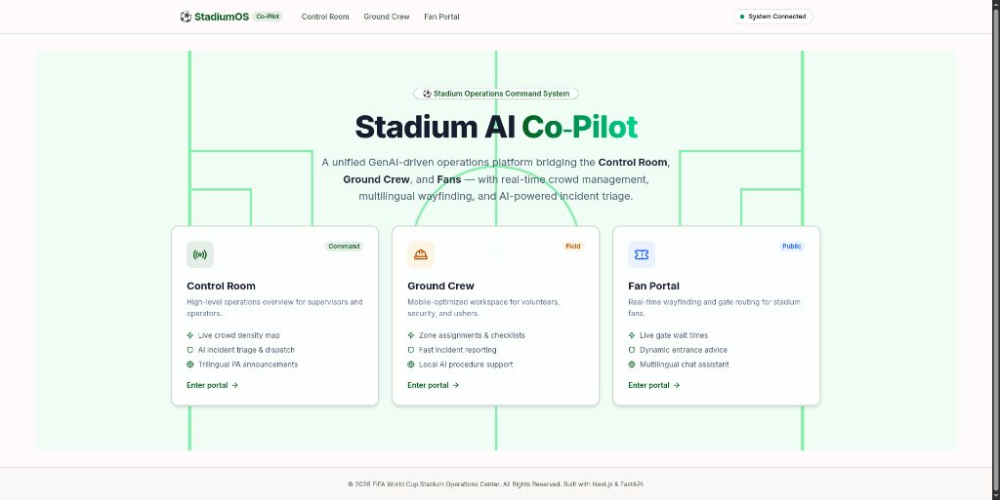
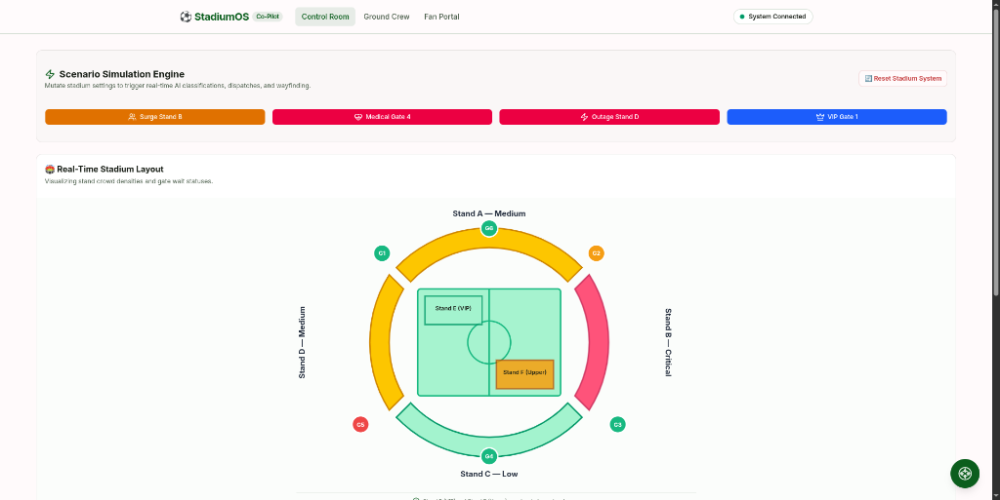
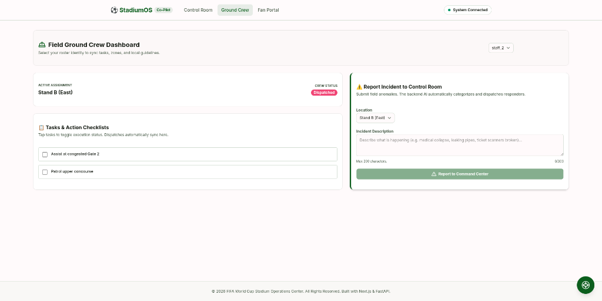
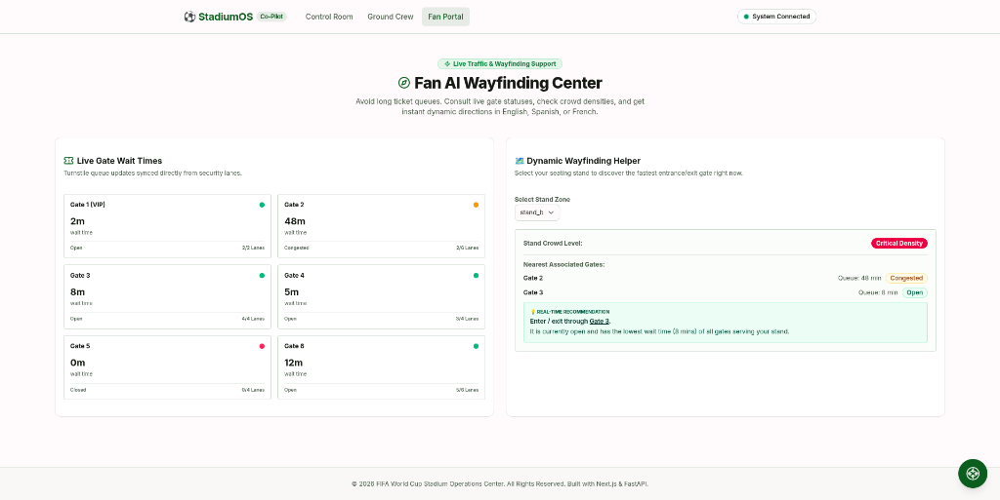

# ⚽ Stadium AI Co-Pilot



Stadium AI Co-Pilot is a unified, real-time stadium operations and wayfinding platform designed to resolve critical safety bottlenecks, gate congestion, and communication barriers during major sporting events like the FIFA World Cup 2026. By connecting stadium operators in the Command Center, field crews on the ground, and fans in the stands to a single, high-resilience AI reasoning engine, the system ensures optimal crowd flow, immediate incident triaging, and instant multilingual public announcements.

### Live Deployed Link
🌐 **[stadium-os-chi.vercel.app](https://stadium-os-chi.vercel.app)** — Frontend (Vercel)  
🗥️ **Backend API**: `https://stadiumos-backend-hk.azurewebsites.net` (Azure App Service, Python + FastAPI)

---

## 📷 View Interfaces

| 📡 Control Room (Command Center) | 🦺 Ground Crew Portal (Field) | 🎫 Fan Wayfinding (Public) |
| :---: | :---: | :---: |
|  |  |  |
| *Visual SVG layout, live incident desk, AI dispatch recommendations, simulation console, trilingual PA alerts.* | *Mobile-responsive roster view, checklist tracking, fast incident reporter form, local assistant chat.* | *Live gate queue board, interactive stand selector with best gate calculations, multilingual chat.* |

---

## 🏆 Chosen Vertical & Approach

### Why "Smart Stadiums & Tournament Operations" (Challenge 4)?
Stadium logistics during a major tournament represent complex bottlenecks: gate congestion, emergency incident triages, and multilingual crowd control are critical, high-risk points of failure. Solving this requires a **unified intelligence layer** that syncs operators, field staff, and public fans in real-time.

### Challenge Brief Angle Coverage

This submission explicitly addresses the following challenge brief angles:

| Angle | Implementation |
|---|---|
| **Navigation & Wayfinding** | Fan Portal: Live gate wait-time board, AI best-gate recommender, and multilingual chat that routes fans to the least-congested gate in real-time. |
| **Crowd Management** | Command Center: Visual SVG crowd density map with per-stand heat levels, one-click scenario simulations (crowd surge, VIP arrival) triggering AI triage. |
| **Multilingual Assistance** | All AI chat responds in the fan's language (EN/ES/FR auto-detected). Trilingual PA Announcement generator creates public address scripts in all three FIFA 2026 host languages. |
| **Operational Intelligence** | Incident desk with AI-generated category, severity, recommended staff, and reasoning. High-availability dual-key failover with honest, transparent rate-limit handling. |
| **Real-Time Decision Support** | Dashboards poll every 4 seconds (visibility-aware to conserve resources). Simulation engine mutates state and immediately re-triages. Gate wait times auto-update across all views. |
| **Transportation & Accessibility** | Gate flow-rate editor lets operators manage turnstile throughput. ARIA live region announces new incidents to screen readers. Keyboard navigation throughout. |
| **Sustainability** | Compact codebase, non-blocking background write queue, client-side polling suspension on inactive tabs, and persistent HTTP connections to keep server and network overhead low. |

### Our Approach: The Unified Co-Pilot
Instead of siloed applications, Stadium AI Co-Pilot connects all three views to a single FastAPI reasoning engine powered by Gemini. 
- **Command Center** views global metrics, triages incidents, drafts public announcements, and dispatches crew.
- **Ground Crew** views assigned tasks, reports local issues, and retrieves protocols.
- **Fans** receive real-time entrance/exit recommendations based on live queue times and crowd density.

---

## 🏗️ System Architecture & Reasoning Layer

```mermaid
graph TD
    subgraph Frontend [Next.js App Router & TypeScript]
        CC[📡 Control Room View]
        GC[🦺 Ground Crew Portal]
        FN[🎫 Fan Portal]
    end

    subgraph Backend [FastAPI Service]
        API[⚡ FastAPI Router]
        LM[🛡️ Rate Limiter Middleware]
        DM[💾 Thread-Safe Data Manager]
        JSON[(stadium_mock_data.json)]
        GC_CLIENT[🤖 Dual-Key Gemini Client]
    end

    subgraph LLM [Gemini API]
        G20[Gemini 2.0 Flash]
    end

    CC -->|Get State / Ask Chat| API
    GC -->|Report Incident / Complete Task| API
    FN -->|Get Wait Times / Wayfinding Chat| API
    
    API --> LM
    LM --> DM
    DM <--> JSON
    
    API --> GC_CLIENT
    GC_CLIENT -->|Try Key 1| G20
    G20 -.-->|Fail / 429| GC_CLIENT
    GC_CLIENT -->|Try Key 2| G20
    G20 -.-->|Fail / 429| API
```

### Key Architectural Decisions

1. **Dual-Key API Failover (Resilience)**:
   The backend reasoning client utilizes the high-performance `gemini-2.0-flash` model. To bypass API rate-limiting issues on free tiers, it implements a primary-to-secondary key failover: if `GEMINI_API_KEY_PRIMARY` returns an HTTP 429, it immediately tries `GEMINI_API_KEY_SECONDARY` before throwing a clean error.
2. **Honest Error Handling**:
   If both keys are exhausted, the app fails honestly by returning a standard HTTP 429 JSON response (`{ "error": "rate_limited", "message": "AI service is temporarily busy. Please try again in a moment." }`). The frontend detects this and renders a friendly warning banner in the chat window with a manual **Retry** button. Mock fallback text and cascading fallback loops have been completely removed to avoid faking AI output.
3. **Prompt-Injection Resistance**:
   Incident reports and chat boxes are untrusted user inputs. The backend sanitizes these inputs, enforces a 300-character cap, and wraps user variables in strict XML-style tags (`<user_untrusted_input>`) in system prompts. It explicitly instructs the model to ignore override statements (like "ignore previous instructions") inside these tags.
4. **Thread-Safe Write Queue**:
   All database writes are performed asynchronously through an in-memory background worker thread, ensuring mutations (resetting, reporting incidents) return immediately to the frontend and eliminate database/disk-write blocking.
5. **In-Memory Per-IP Cooldown**:
   A 3-second cooldown is enforced on public chat requests to prevent double-clicks or bot spam from exhausting API quotas.

---

## ⚡ Try It out (Judges Cheat Sheet)

Copy-paste these example prompts into the chat box of each portal to test the AI's reasoning:

1. **Control Room Chat Prompt**:
   > *"We have a crowd surge in Stand B. Recommend an evacuation routing strategy using alternative gates based on live wait times."*
   >
   > *AI Response:* Identifies that Gate 2 (serving Stand B) is congested (48 min wait) and Stand B density is Critical; suggests routing fans through Gate 3 (8 min wait) or Gate 4 (5 min wait).
   
2. **Ground Crew Chat Prompt**:
   > *"A fan at concession area C4 reported a lost child. What is the official protocol I should follow?"*
   >
   > *AI Response:* Recommends staying with the child, reporting immediately to Supervisor Robert Duval, and accompanying them to the nearest First Aid Station.

3. **Fan Portal Chat Prompt**:
   > *"I'm in Stand B and want to exit. Which gate is faster right now?"*
   >
   > *AI Response:* Dynamically reads live database, compares Gate 2 (48m wait) vs Gate 3 (8m wait), and routes the fan to Gate 3 for a faster exit.

---

## 🛠️ Setup Instructions

### Prerequisites
- Node.js v20+ / npm v10+
- Python 3.10+
- Gemini API Keys (Primary and Secondary)

### Backend Setup
1. Navigate to the backend directory:
   ```bash
   cd backend
   ```
2. Create and activate a virtual environment:
   ```bash
   python3 -m venv .venv
   source .venv/bin/activate
   ```
3. Install dependencies:
   ```bash
   pip install -r requirements.txt
   ```
4. Create a `.env` file in the `backend/` directory:
   ```env
   GEMINI_API_KEY_PRIMARY=your_primary_gemini_api_key_here
   GEMINI_API_KEY_SECONDARY=your_secondary_gemini_api_key_here
   ```
5. Run the server:
   ```bash
   uvicorn app.main:app --host 127.0.0.1 --port 8000 --reload
   ```

### Frontend Setup
1. Navigate to the frontend directory:
   ```bash
   cd frontend
   ```
2. Install dependencies:
   ```bash
   npm install
   ```
3. Run the development server:
   ```bash
   npm run dev
   ```
4. Open [http://localhost:3000](http://localhost:3000) in your browser.

### Running Backend Unit Tests
Verify data manager concurrency, API endpoints, rate limiting, and prompt-injection resistance:
```bash
cd backend
PYTHONPATH=. pytest tests/ -v
```

---

## 📐 Known Limitations

- **Shared-State Tradeoff**: The stadium state is stored in a single mock JSON file. Because mock data is mutated on the backend (e.g. when clicking simulation triggers or completing tasks), **all active live visitors will share the same state**. In a production system, this would be scoped to individual user sessions or distinct stadium databases.
- **API Quota Dependence**: Since the app handles API rate-limiting honestly without mock fallbacks, users may occasionally see a "temporarily busy" notification if both API keys have exceeded their Requests Per Minute (RPM) limits under heavy traffic.

---

## ♿ Accessibility Specifics (WCAG AA Compliance)

- **Accessible Colors**: Text elements in the white-and-green design use a high-contrast dark forest green (`#166534`) that exceeds the WCAG AA 4.5:1 ratio against light backgrounds.
- **Screen Reader Announcements**: The live incident feed utilizes `aria-live="polite"` to read out new operational incidents automatically.
- **Keyboard Navigation**: Interactive tables, forms, and cards are fully focusable using Tab and executable using Space/Enter. Focus outlines (`ring-2 ring-primary`) are highly visible.
- **Reduced Motion**: Disables status animations and pulsing borders for users who have enabled `prefers-reduced-motion` at the OS level.
