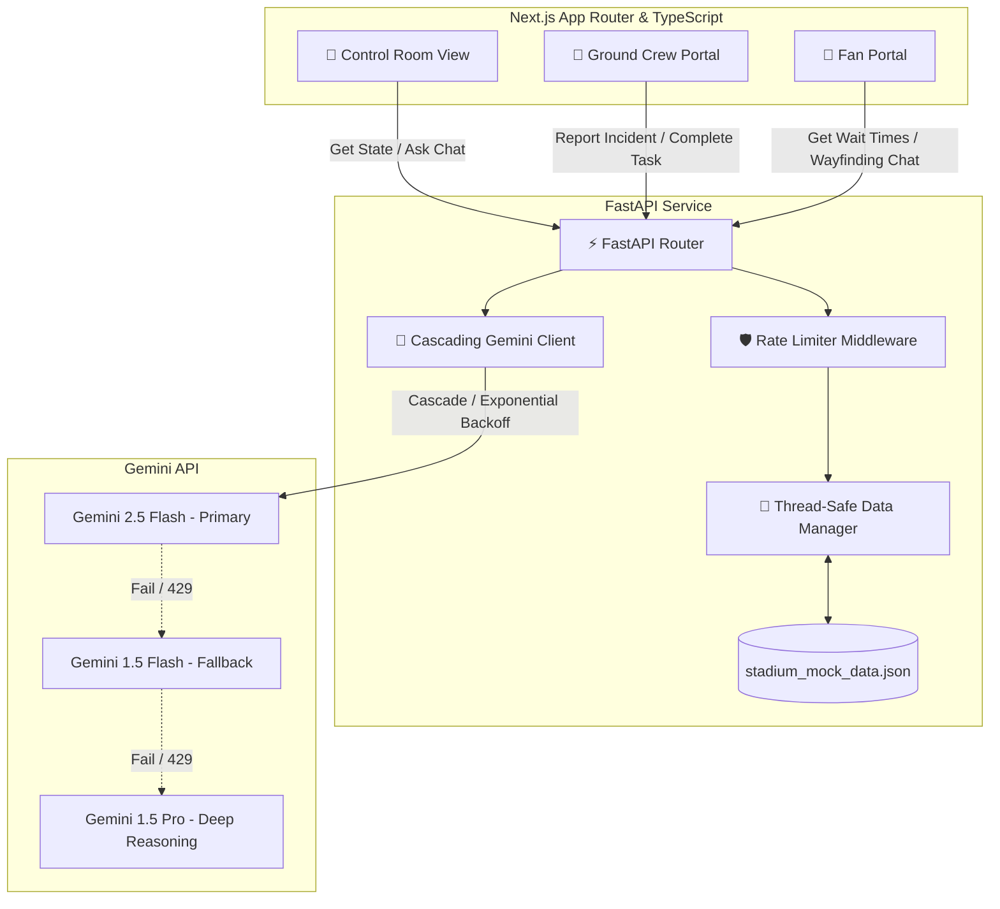

# ⚽ Stadium AI Co-Pilot

A unified, real-time stadium operations and wayfinding platform built for the **FIFA World Cup 2026 Stadium Operations Challenge (Challenge 4)**. It bridges the gap between the Control Room, Field Crew, and Fans under a single, secure backend reasoning layer.

### Live Deployed Link
🌐 **[Live Demo URL](https://stadium-os-frontend.vercel.app)** *(Placeholder - deploy your Next.js and FastAPI services and insert links here)*

---

## 📷 View Interfaces

| 📡 Control Room (Command Center) | 🦺 Ground Crew Portal (Field) | 🎫 Fan Wayfinding (Public) |
| :---: | :---: | :---: |
|  |  |  |
| *Visual SVG layout, live incident desk, AI dispatch recommendations, simulation console, trilingual PA alerts.* | *Mobile-responsive roster view, checklist tracking, fast incident reporter form, local assistant chat.* | *Live gate queue board, interactive stand selector with best gate calculations, multilingual chat.* |

---

## 🏆 Chosen Vertical & Approach

### Why "Smart Stadiums & Tournament Operations" (Challenge 4)?
Stadium logistics during a major tournament represent complex bottlenecks: gate congestion, emergency incident triages, and multilingual crowd control are critical, high-risk points of failure. Solving this requires a **unified intelligence layer** that syncs operators, field staff, and public fans in real-time.

### Our Approach: The Unified Co-Pilot
Instead of siloed applications, Stadium AI Co-Pilot connects all three views to a single FastAPI reasoning engine powered by Gemini. 
- **Command Center** views global metrics, triages incidents, drafts public announcements, and dispatches crew.
- **Ground Crew** views assigned tasks, reports local issues, and retrieves protocols.
- **Fans** receive real-time entrance/exit recommendations based on live queue times and crowd density.

---

## 🏗️ System Architecture & Reasoning Layer



### Key Architectural Decisions

1. **Cascading Model Sequence (Rate-Limit Handler)**:
   The backend reasoning client attempts calls starting with the fast, high-performance `gemini-2.5-flash`. If it hits rate limits (HTTP 429) or transient server errors, it logs a warning and cascades to `gemini-1.5-flash`, then `gemini-1.5-pro`, retrying with exponential backoff and randomized jitter.
2. **Prompt-Injection Resistance**:
   Incident reports and chat boxes are untrusted user inputs. The backend sanitizes these inputs, enforces a 300-character cap, and wraps user variables in strict XML-style tags (`<user_untrusted_input>`) in system prompts. It explicitly instructs the model to ignore override statements (like "ignore previous instructions") inside these tags.
3. **AI Reasoning Transparency**:
   Every operational recommendation includes an AI-generated `"why"` justification displayed directly to the operator (e.g. *"Recommended: Medic Elena Rostova — nearest medical staff to Gate 4, currently unassigned"*).
4. **Trilingual Dynamic PA Generator**:
   Connects the staff and fan experiences: given an active incident, operators can generate a public-address announcement drafted by the AI in **English, Spanish, and French** (the languages of the FIFA 2026 hosts: USA, Mexico, Canada) to redirect fans.

---

## ⚡ Try It out (Judges Cheat Sheet)

Copy-paste these example prompts into the chat box of each portal to test the AI's reasoning:

1. **Control Room Chat Prompt**:
   > *"We have a crowd surge in Stand B. Recommend an evacuation routing strategy using alternative gates based on live wait times."*
   >
   > *AI Response:* Identifies that Gate 2 (serving Stand B) is congested (28 min wait) and Stand B density is High; suggests routing fans through Gate 3 (8 min wait) or Gate 4 (5 min wait).
   
2. **Ground Crew Chat Prompt**:
   > *"A fan at concession area C4 reported a lost child. What is the official protocol I should follow?"*
   >
   > *AI Response:* Recommends staying with the child, reporting immediately to Supervisor Robert Duval, and accompanying them to the nearest First Aid Station.

3. **Fan Portal Chat Prompt**:
   > *"I'm in Stand B and want to exit. Which gate is faster right now?"*
   >
   > *AI Response:* Dynamically reads live database, compares Gate 2 (28m wait) vs Gate 3 (8m wait), and routes the fan to Gate 3 for a faster exit.

---

## 🛠️ Setup Instructions

### Prerequisites
- Node.js v20+ / npm v10+
- Python 3.10+
- Gemini API Key

### Backend Setup
1. Navigate to the backend directory:
   ```bash
   cd backend
   ```
2. Create and activate a virtual environment:
   ```bash
   python3 -m venv .venv
   source .venv/bin/activate
   ```
3. Install dependencies:
   ```bash
   pip install -r requirements.txt
   ```
4. Create a `.env` file in the `backend/` directory:
   ```env
   GEMINI_API_KEY=your_gemini_api_key_here
   ```
5. Run the server:
   ```bash
   uvicorn app.main:app --host 127.0.0.1 --port 8000 --reload
   ```

### Frontend Setup
1. Navigate to the frontend directory:
   ```bash
   cd frontend
   ```
2. Install dependencies:
   ```bash
   npm install
   ```
3. Run the development server:
   ```bash
   npm run dev
   ```
4. Open [http://localhost:3000](http://localhost:3000) in your browser.

### Running Backend Unit Tests
Verify data manager concurrency, API endpoints, rate limiting, and prompt-injection resistance:
```bash
cd backend
PYTHONPATH=. pytest tests/ -v
```

---

## 📐 Assumptions & Caveats

- **Shared-State Tradeoff**: The stadium state is stored in a single mock JSON file. Because mock data is mutated on the backend (e.g. when clicking simulation triggers or completing tasks), **all active live visitors will share the same state**. In a production system, this would be scoped to individual user sessions or distinct stadium databases.
- **Network-First Fallback**: If `GEMINI_API_KEY` is not present, the client automatically defaults to a local rule-based heuristic classifier to keep the application 100% operational for offline testing.

---

## ♿ Accessibility Specifics (WCAG AA Compliance)

- **Accessible Colors**: Text elements in the white-and-green design use a high-contrast dark forest green (`#166534`) that exceeds the WCAG AA 4.5:1 ratio against light backgrounds.
- **Screen Reader Announcements**: The live incident feed utilizes `aria-live="polite"` to read out new operational incidents automatically.
- **Keyboard Navigation**: Interactive tables, forms, and cards are fully focusable using Tab and executable using Space/Enter. Focus outlines (`ring-2 ring-primary`) are highly visible.
- **Reduced Motion**: Disables status animations and pulsing borders for users who have enabled `prefers-reduced-motion` at the OS level.

---

## 🚀 What We'd Add with More Time

1. **WebSockets Integration**: Replace polling with WebSockets to stream crowd densities and gate metrics instantly.
2. **Indoor SVG Navigation**: Visual turn-by-turn pathfinding lines drawn on the stadium SVG layout.
3. **Multimodal Incident Reporting**: Allow ground crew to snap photos of turnstile issues or bag backlogs, feeding images directly to Gemini's vision capability to assess repair severity.
